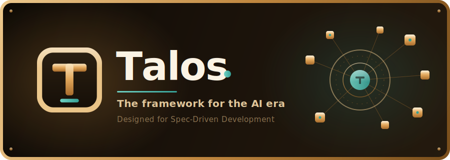

<a id="readme-top"></a>

<!-- PROJECT SHIELDS -->
[![Contributors][contributors-shield]][contributors-url]
[![Forks][forks-shield]][forks-url]
[![Stargazers][stars-shield]][stars-url]
[![Issues][issues-shield]][issues-url]
[![MIT License][license-shield]][license-url]

<!-- PROJECT LOGO -->
<br />
<div align="center">
  <a href="https://github.com/ooneex/talos">
    
  </a>

  <br />
  <br />

  <p align="center">
    A modular TypeScript framework built on Bun — 60+ independent packages and the first framework designed around Spec-Driven Development.
    <br />
    <br />
    <a href="https://docs.talosjs.com/getting-started"><strong>Explore the docs »</strong></a>
    <br />
    <br />
    <a href="https://github.com/ooneex/talos/issues/new?labels=bug">Report Bug</a>
    &middot;
    <a href="https://github.com/ooneex/talos/issues/new?labels=enhancement">Request Feature</a>
  </p>
</div>

<!-- TABLE OF CONTENTS -->
<details>
  <summary>Table of Contents</summary>
  <ol>
    <li>
      <a href="#about-the-project">About The Project</a>
      <ul>
        <li><a href="#built-with">Built With</a></li>
        <li><a href="#packages">Packages</a></li>
      </ul>
    </li>
    <li>
      <a href="#getting-started">Getting Started</a>
      <ul>
        <li><a href="#prerequisites">Prerequisites</a></li>
        <li><a href="#installation">Installation</a></li>
      </ul>
    </li>
    <li><a href="#usage">Usage</a></li>
    <li><a href="#architecture">Architecture</a></li>
    <li><a href="#spec-driven-development">Spec-Driven Development</a></li>
    <li><a href="#development">Development</a></li>
    <li><a href="#roadmap">Roadmap</a></li>
    <li><a href="#contributing">Contributing</a></li>
    <li><a href="#license">License</a></li>
    <li><a href="#acknowledgments">Acknowledgments</a></li>
  </ol>
</details>

<!-- ABOUT THE PROJECT -->
## About The Project

<div align="center">
  
</div>

<br />

Talos is a comprehensive TypeScript monorepo framework designed for the [Bun](https://bun.sh) runtime. It provides a rich ecosystem of 60+ independently versioned packages under the `@talosjs` namespace, covering everything from dependency injection and routing to database management, caching, authentication, real-time communication, background job queues, and AI integration.

It is also the first framework designed around **Spec-Driven Development** — your work lives as structured specs that AI agents can find, plan, and implement against your real conventions, with every step transparent and verifiable. See [Spec-Driven Development](#spec-driven-development) below.

**Key highlights:**

- **Modular architecture** — Use only the packages you need. Each package is independently versioned and published to npm.
- **Built for the AI era** — First-class AI agents, RAG, and a Spec-Driven workflow baked into the core, so AI builds _with_ you instead of guessing.
- **Dependency injection** — Built on [InversifyJS](https://inversify.io/) with decorator-driven service registration and lifecycle management (singleton, transient, request-scoped).
- **Decorator-driven design** — Define routes, services, repositories, and middlewares using clean, expressive decorators.
- **Type-safe** — Strict TypeScript configuration with comprehensive type checking and runtime validation via [ArkType](https://arktype.io/).
- **Bun-first** — Optimized for the Bun runtime with fast builds via [bunup](https://github.com/nicepkg/bunup) and native Bun test runner support.

📚 **Full documentation:** [docs.talosjs.com](https://docs.talosjs.com/getting-started)

<p align="right">(<a href="#readme-top">back to top</a>)</p>

### Built With

[![Bun][Bun-badge]][Bun-url]
[![TypeScript][TypeScript-badge]][TypeScript-url]
[![Nx][Nx-badge]][Nx-url]
[![Biome][Biome-badge]][Biome-url]
[![InversifyJS][Inversify-badge]][Inversify-url]
[![TypeORM][TypeORM-badge]][TypeORM-url]
[![React][React-badge]][React-url]

<p align="right">(<a href="#readme-top">back to top</a>)</p>

### Packages

The framework is organized into 60+ packages across several categories:

#### Application & Architecture
| Package | Description |
|---------|-------------|
| `@talosjs/app` | Full-featured application framework — orchestrates routing, middleware, DI, caching, logging, and WebSockets |
| `@talosjs/app-env` | Environment detection and typed configuration for development, staging, production, and testing |
| `@talosjs/container` | Dependency injection container built on Inversify with singleton, transient, and request scopes |
| `@talosjs/module` | Module system for organizing application features into cohesive domain units |
| `@talosjs/service` | Service layer foundation with decorator-based registration |
| `@talosjs/repository` | Data access layer with decorator-based repository registration |
| `@talosjs/command` | Command framework for building CLI commands with DI and argument parsing |
| `@talosjs/exception` | Structured exception handling with HTTP status mapping and typed error data |
| `@talosjs/types` | Shared TypeScript type definitions and utility types |
| `@talosjs/utils` | General-purpose utilities — unique ID generation, type guards, and helpers |
| `@talosjs/cli` | Interactive CLI toolkit for scaffolding projects, modules, controllers, services, and repositories |

#### HTTP & Routing
| Package | Description |
|---------|-------------|
| `@talosjs/routing` | Decorator-driven HTTP routing with path params, validation, permission guards, and named routes |
| `@talosjs/controller` | HTTP controller layer with decorator-based route binding |
| `@talosjs/middleware` | Middleware pipeline framework for HTTP and WebSocket events |
| `@talosjs/http-request` | HTTP request abstraction — URL parsing, query params, headers, file uploads |
| `@talosjs/http-request-file` | Multipart file upload handler with MIME validation and size constraints |
| `@talosjs/http-response` | HTTP response builder with a fluent API for status, headers, cookies, and streams |
| `@talosjs/http-header` | HTTP header parser with user agent detection and content negotiation |
| `@talosjs/http-mimes` | Complete MIME type registry with TypeScript constants |
| `@talosjs/http-status` | HTTP status code library with TypeScript enums and classification helpers |
| `@talosjs/fetcher` | Lightweight HTTP client with typed headers and response parsing |
| `@talosjs/url` | URL parsing and manipulation — query strings, path normalization, route params |
| `@talosjs/rate-limit` | API rate limiting middleware with throttling strategies and per-client quotas |

#### Real-Time
| Package | Description |
|---------|-------------|
| `@talosjs/socket` | WebSocket server with room management, broadcasting, and middleware integration |
| `@talosjs/socket-client` | WebSocket client with automatic reconnection and typed message serialization |
| `@talosjs/event` | Event messaging for decoupled, event-driven communication with typed channels |

#### Data & Persistence
| Package | Description |
|---------|-------------|
| `@talosjs/database` | Database abstraction layer with TypeORM integration and connection pooling |
| `@talosjs/entity` | Base entity classes and decorators for type-safe column mappings and relationships |
| `@talosjs/migrations` | Database migration runner with versioned schema changes and rollback |
| `@talosjs/seeds` | Database seeding framework for fixtures with idempotent operations |
| `@talosjs/cache` | High-performance caching with filesystem and Redis backends and TTL expiration |
| `@talosjs/storage` | File storage abstraction over local filesystem and cloud providers |
| `@talosjs/rag` | Retrieval-Augmented Generation toolkit with vector DB integration and embeddings |

#### Auth & Access Control
| Package | Description |
|---------|-------------|
| `@talosjs/auth` | Authentication framework with pluggable token- and session-based strategies |
| `@talosjs/jwt` | JWT toolkit using JOSE — generate, sign, verify, and decode tokens |
| `@talosjs/permission` | Fine-grained access control using CASL with role/resource scoping |
| `@talosjs/role` | Role-based authorization types and utilities |
| `@talosjs/user` | User identity types — profiles, credentials, roles, and account metadata |

#### AI & Integrations
| Package | Description |
|---------|-------------|
| `@talosjs/ai` | AI toolkit integrating 300+ models via OpenRouter with unified text generation and streaming |
| `@talosjs/analytics` | PostHog-powered analytics for tracking user behavior and product events |
| `@talosjs/linear` | Linear project management integration for issues, teams, and projects |
| `@talosjs/mailer` | Transactional email via Nodemailer SMTP and Resend with templated emails |
| `@talosjs/payment` | Payment and pricing type definitions with currency handling |
| `@talosjs/youtube` | YouTube video downloader and metadata extraction |
| `@talosjs/youtube-utils` | YouTube URL utilities for video IDs and embed/watch URLs |

#### Cross-Cutting Services
| Package | Description |
|---------|-------------|
| `@talosjs/logger` | Structured logging with multiple output targets and contextual metadata |
| `@talosjs/cron` | Cron job scheduler with timezone-aware scheduling and lifecycle management |
| `@talosjs/validation` | Type-safe validation powered by ArkType with JSON Schema generation |
| `@talosjs/feature-flag` | Define and evaluate feature flags as injectable, named toggles |
| `@talosjs/translation` | Internationalization with locale management, key resolution, and pluralization |
| `@talosjs/queue` | Background job queue powered by BullMQ and Redis with retries and progress tracking |
| `@talosjs/workflow` | Transition-based workflow engine with conditional steps and automatic rollback |

#### File & Document Formats
| Package | Description |
|---------|-------------|
| `@talosjs/fs` | Async file system utilities for reading, writing, copying, and watching |
| `@talosjs/csv` | CSV file loader and parser with streaming and generator-based iteration |
| `@talosjs/json` | JSON file loader and parser with streaming and generator-based iteration |
| `@talosjs/yml` | YAML file loader and parser using Bun's built-in YAML support |
| `@talosjs/html` | HTML parsing and DOM manipulation powered by Cheerio |
| `@talosjs/pdf` | PDF toolkit for generating, editing, merging, splitting, and converting documents |

#### Reference Data & Helpers
| Package | Description |
|---------|-------------|
| `@talosjs/color` | Curated color palette with hex values, names, and TypeScript types |
| `@talosjs/country` | Country metadata — timezones, ISO codes, and multi-language localization |
| `@talosjs/currencies` | Currency dataset with ISO 4217 codes, symbols, and names |
| `@talosjs/hour-utils` | Time unit conversion utilities for hours, minutes, seconds, and milliseconds |

<p align="right">(<a href="#readme-top">back to top</a>)</p>

<!-- GETTING STARTED -->
## Getting Started

### Prerequisites

- [Bun](https://bun.sh) (latest version recommended)

  ```sh
  curl -fsSL https://bun.sh/install | bash
  ```

  Verify the install:

  ```sh
  bun --version
  ```

### Quick Start

The fastest way to build with Talos is the `talos` CLI. Install it globally, scaffold an app, and start the dev environment.

1. Install the CLI

   ```sh
   bun add -g @talosjs/cli
   talos help
   ```

2. Create a new application

   ```sh
   talos app:create --name=MovieApp --destination=movie-app
   cd movie-app
   ```

3. Start the development environment (launches Docker services and runs all modules with hot reload)

   ```sh
   talos app:start            # everything
   talos app:start --api      # API modules only
   talos app:start --spa      # SPA modules only
   ```

   Stop it again with `talos app:stop`.

For configuration, project structure, and the full framework guide, see the [getting started docs](https://docs.talosjs.com/getting-started).

### Working on the Monorepo

To develop the framework packages themselves:

1. Clone the repository

   ```sh
   git clone https://github.com/ooneex/talos.git
   cd Talos
   ```

2. Install dependencies

   ```sh
   bun install
   ```

3. Build all packages

   ```sh
   bun run build
   ```

4. Run the test suite

   ```sh
   bun run test
   ```

<p align="right">(<a href="#readme-top">back to top</a>)</p>

<!-- USAGE -->
## Usage

Install individual packages from npm as needed:

```sh
bun add @talosjs/app @talosjs/routing @talosjs/container
```

### Defining a Service

```typescript
import { decorator } from "@talosjs/service";

@decorator.service()
class UserService {
  findAll() {
    // ...
  }
}
```

### Defining a Route

```typescript
import { decorator } from "@talosjs/routing";

@decorator.controller()
class UserController {
  @decorator.get("/users")
  index() {
    // ...
  }
}
```

### Using the DI Container

```typescript
import { Container } from "@talosjs/container";

const userService = Container.get<UserService>(UserService);
```

<p align="right">(<a href="#readme-top">back to top</a>)</p>

<!-- ARCHITECTURE -->
## Architecture

```
Talos/
├── packages/           # All 60+ independent packages
│   ├── app/            # Application orchestrator
│   ├── container/      # DI container (core dependency)
│   ├── routing/        # HTTP routing
│   ├── database/       # Database layer
│   └── ...
├── nx.json             # Nx monorepo configuration
├── tsconfig.json       # Shared TypeScript config
├── biome.jsonc         # Linting and formatting rules
└── package.json        # Root workspace configuration
```

### Dependency Injection

The framework uses a centralized DI container based on InversifyJS. Each package provides decorators that register classes with the container using configurable scopes:

- **Singleton** (default) — One instance shared across the entire application
- **Transient** — New instance created on every resolution
- **Request** — One instance per HTTP request lifecycle

### Naming Conventions

Strictly enforced by decorators at registration time:

| Type | Suffix | Example |
|------|--------|---------|
| Service | `Service` | `UserService` |
| Repository | `Repository` | `UserRepository` |
| Middleware | `Middleware` | `AuthMiddleware` |

<p align="right">(<a href="#readme-top">back to top</a>)</p>

<!-- SPEC-DRIVEN DEVELOPMENT -->
## Spec-Driven Development

Talos turns vague requests into structured **specs** — YAML issues with context, goals, a definition of done, and dependencies — that flow through a transparent AI workflow. AI agents find, plan, and implement against your module's real conventions, and each step is verifiable against the spec's definition of done.

| Step | Command | What it does |
|------|---------|--------------|
| **Find** | `/issue:found` | Audits a module's source code to surface concrete findings as candidate issues. |
| **Plan** | `/issue:plan` | Turns a free-form request into a precise, reviewable spec before any code is written. |
| **Fix** | `/issue:fix` | Implements each planned issue, runs lint, and verifies every acceptance criterion before marking it done. |

Each unit of work becomes a YAML file under `issues/`, evolving through four fields — `context`, `goal`, `dod` (definition of done), and `dependencies` — and progressing through states from `Backlog` to `Done`.

Get started by initializing the AI skills for your agent:

```sh
talos claude:init   # or: talos codex:init
```

Learn more in the [Spec-Driven Development guide](https://docs.talosjs.com/ai/spec-driven-development).

<p align="right">(<a href="#readme-top">back to top</a>)</p>

<!-- DEVELOPMENT -->
## Development

### Commands

| Command | Description |
|---------|-------------|
| `bun run build` | Build all packages (Nx `run-many`) |
| `bun run test` | Run all tests |
| `bun run lint` | Lint all packages (Biome + TypeScript) |
| `bun run fmt` | Format and auto-fix code with Biome |
| `bun run check` | Install + build + lint + test (full validation) |
| `bun run npm:publish` | Publish all packages to npm |
| `bunx nx graph` | Visualize the dependency graph |

### Running Tests for a Specific Package

```sh
bun test packages/<package-name>/tests
```

### Commit Conventions

This project uses [Conventional Commits](https://www.conventionalcommits.org/) enforced by commitlint and Husky pre-commit hooks.

```
type(scope): Subject line
```

**Types:** `feat`, `fix`, `refactor`, `test`, `chore`, `docs`, `style`, `perf`, `build`, `ci`, `revert`

**Scopes:** Package names (e.g., `routing`, `cache`) or `common` for repo-wide changes.

```sh
# Examples
feat(service): Add decorators and tests
fix(routing): Resolve path parameter parsing
chore(common): Update bun.lock dependencies
```

<p align="right">(<a href="#readme-top">back to top</a>)</p>

<!-- ROADMAP -->
## Roadmap

See the [open issues](https://github.com/ooneex/talos/issues) for a full list of proposed features and known issues.

<p align="right">(<a href="#readme-top">back to top</a>)</p>

<!-- CONTRIBUTING -->
## Contributing

Contributions are welcome and appreciated. If you have a suggestion that would make this better, please fork the repo and create a pull request.

1. Fork the project
2. Create your feature branch (`git checkout -b feat/amazing-feature`)
3. Commit your changes (`git commit -m 'feat(scope): Add amazing feature'`)
4. Push to the branch (`git push origin feat/amazing-feature`)
5. Open a pull request

<p align="right">(<a href="#readme-top">back to top</a>)</p>

<!-- LICENSE -->
## License

Distributed under the MIT License. See [`LICENSE`](LICENSE) for more information.

<p align="right">(<a href="#readme-top">back to top</a>)</p>

<!-- ACKNOWLEDGMENTS -->
## Acknowledgments

- [Bun](https://bun.sh) — Fast all-in-one JavaScript runtime
- [Nx](https://nx.dev) — Smart monorepo build system
- [InversifyJS](https://inversify.io/) — Powerful IoC container for TypeScript
- [TypeORM](https://typeorm.io/) — ORM for TypeScript and JavaScript
- [ArkType](https://arktype.io/) — TypeScript's 1:1 validator
- [Biome](https://biomejs.dev/) — Fast formatter and linter
- [bunup](https://github.com/nicepkg/bunup) — Bun-native bundler

<p align="right">(<a href="#readme-top">back to top</a>)</p>

<!-- MARKDOWN LINKS & IMAGES -->
[contributors-shield]: https://img.shields.io/github/contributors/ooneex/talos.svg?style=for-the-badge&color=432371
[contributors-url]: https://github.com/ooneex/talos/graphs/contributors
[forks-shield]: https://img.shields.io/github/forks/ooneex/talos.svg?style=for-the-badge&color=FAAE7B
[forks-url]: https://github.com/ooneex/talos/network/members
[stars-shield]: https://img.shields.io/github/stars/ooneex/talos.svg?style=for-the-badge&color=2ea043
[stars-url]: https://github.com/ooneex/talos/stargazers
[issues-shield]: https://img.shields.io/github/issues/ooneex/talos.svg?style=for-the-badge&color=e34c26
[issues-url]: https://github.com/ooneex/talos/issues
[license-shield]: https://img.shields.io/badge/License-MIT-green.svg?style=for-the-badge&color=60A5FA
[license-url]: https://github.com/ooneex/talos/blob/main/LICENSE
[Bun-badge]: https://img.shields.io/badge/Bun-000000?style=for-the-badge&logo=bun&logoColor=white
[Bun-url]: https://bun.sh
[TypeScript-badge]: https://img.shields.io/badge/TypeScript-3178C6?style=for-the-badge&logo=typescript&logoColor=white
[TypeScript-url]: https://www.typescriptlang.org/
[Nx-badge]: https://img.shields.io/badge/Nx-143055?style=for-the-badge&logo=nx&logoColor=white
[Nx-url]: https://nx.dev
[Biome-badge]: https://img.shields.io/badge/Biome-60A5FA?style=for-the-badge&logo=biome&logoColor=white
[Biome-url]: https://biomejs.dev
[Inversify-badge]: https://img.shields.io/badge/InversifyJS-E8542E?style=for-the-badge
[Inversify-url]: https://inversify.io/
[TypeORM-badge]: https://img.shields.io/badge/TypeORM-FE0803?style=for-the-badge&logo=typeorm&logoColor=white
[TypeORM-url]: https://typeorm.io/
[React-badge]: https://img.shields.io/badge/React-61DAFB?style=for-the-badge&logo=react&logoColor=black
[React-url]: https://react.dev/
