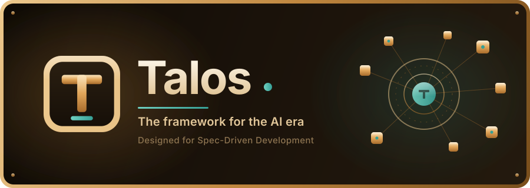

<a id="readme-top"></a>

<!-- PROJECT SHIELDS -->
[![Contributors][contributors-shield]][contributors-url]
[![Forks][forks-shield]][forks-url]
[![Stargazers][stars-shield]][stars-url]
[![Issues][issues-shield]][issues-url]
[![MIT License][license-shield]][license-url]

<!-- PROJECT LOGO -->
<br />
<div align="center">
  

  <br />
  <br />

  <p align="center">
    <strong>A modular TypeScript framework for Bun, built around Spec-Driven Development.</strong>
    <br />
    62 independent packages covering HTTP, data, security, real-time, and AI.
    <br />
    <br />
    <a href="https://docs.talosjs.com/getting-started"><strong>Explore the docs »</strong></a>
    <br />
    <br />
    <a href="https://docs.talosjs.com/getting-started/create-app">Create an app</a>
    &middot;
    <a href="https://github.com/ooneex/talos/issues/new?labels=bug">Report Bug</a>
    &middot;
    <a href="https://github.com/ooneex/talos/issues/new?labels=enhancement">Request Feature</a>
  </p>
</div>

<!-- TABLE OF CONTENTS -->
<details>
  <summary>Table of Contents</summary>
  <ol>
    <li>
      <a href="#about-the-project">About The Project</a>
      <ul>
        <li><a href="#why-talos">Why Talos</a></li>
        <li><a href="#built-with">Built With</a></li>
      </ul>
    </li>
    <li>
      <a href="#getting-started">Getting Started</a>
      <ul>
        <li><a href="#prerequisites">Prerequisites</a></li>
        <li><a href="#create-your-app">Create your app</a></li>
        <li><a href="#build-your-first-resource">Build your first resource</a></li>
      </ul>
    </li>
    <li><a href="#roadmap">Roadmap</a></li>
    <li>
      <a href="#development">Development</a>
      <ul>
        <li><a href="#working-on-the-monorepo">Working on the Monorepo</a></li>
        <li><a href="#commit-conventions">Commit Conventions</a></li>
      </ul>
    </li>
    <li><a href="#contributing">Contributing</a></li>
    <li><a href="#license">License</a></li>
    <li><a href="#acknowledgments">Acknowledgments</a></li>
  </ol>
</details>

<!-- ABOUT THE PROJECT -->
## About The Project

<div align="center">
  
</div>

<br />

Talos is a modular TypeScript framework built on [Bun](https://bun.sh). It ships as 62 independent packages under the `@talosjs` namespace, each versioned on its own, covering HTTP, data, security, real-time, AI, and general utilities, plus the `talos` CLI that scaffolds and runs it all. You install only the packages you need.

Its distinguishing feature is Spec-Driven Development. Instead of prompting an AI agent from scratch, you describe work as structured specs — YAML files with context, goals, and a definition of done — that agents can read, plan against, and implement using your module's existing conventions. The same codebase scales from a side project to a multi-service platform without a rewrite.

Full documentation: [docs.talosjs.com](https://docs.talosjs.com/getting-started).

<p align="right">(<a href="#readme-top">back to top</a>)</p>

### Why Talos

- **Decorator-driven** — Routes, services, and repositories are declared with decorators and sensible defaults, so there's little boilerplate to write.
- **AI in the core** — Agents, RAG, and the Spec-Driven workflow are built in rather than bolted on.
- **SaaS building blocks** — Auth, JWT, roles, permissions, payments, caching, queues, and a mailer ship as packages.
- **Type-safe with runtime validation** — Strict TypeScript backed by [ArkType](https://arktype.io/); your `params`, `payload`, `queries`, and `response` shapes are typed through the whole handler.
- **Extensible** — Dependency injection and a module system let you add, swap, or override components.

<p align="right">(<a href="#readme-top">back to top</a>)</p>

### Built With

[![Bun][Bun-badge]][Bun-url]
[![TypeScript][TypeScript-badge]][TypeScript-url]
[![Biome][Biome-badge]][Biome-url]
[![InversifyJS][Inversify-badge]][Inversify-url]
[![TypeORM][TypeORM-badge]][TypeORM-url]
[![React][React-badge]][React-url]

<p align="right">(<a href="#readme-top">back to top</a>)</p>

<!-- GETTING STARTED -->
## Getting Started

A few commands take you from an empty machine to a running Talos app with its first domain.

### Prerequisites

Your app and every generated module run on [Bun](https://bun.sh). Install it first:

```sh
curl -fsSL https://bun.sh/install | bash
bun --version
```

### Create your app

1. **Install the CLI.** It's a self-contained native binary — no Node or Bun needed to run it. The installer drops it in `~/.talos/bin`, adds that to your `PATH`, symlinks the short alias `oo`, and installs shell completions.

   ```sh
   curl -fsSL https://raw.githubusercontent.com/ooneex/talos/main/packages/cli/scripts/install.sh | bash
   ```

   On Windows:

   ```powershell
   powershell -c "irm https://raw.githubusercontent.com/ooneex/talos/main/packages/cli/scripts/install.ps1 | iex"
   ```

   Then open a new shell and check it:

   ```sh
   talos help     # or: oo help
   ```

   > `talos` and `oo` are the same binary — use whichever you prefer. `talos upgrade` pulls the latest release later on.

2. **Scaffold a complete application.** This creates the `app` and `shared` modules, the entrypoint, the shared database, roles, Docker files, and config, then installs dependencies. You'll be asked whether to add CI/CD files for GitHub, GitLab, or Bitbucket.

   ```sh
   talos app:create --name=MovieApp --destination=movie-app
   cd movie-app
   ```

3. **Start the development environment.** `app:start` brings up the shared Docker stack, then runs every runnable module — `api`, `microservice`, `spa`, `admin`, `storybook`, and `swagger` — concurrently with hot reload. Narrow it with `--modules` or `--packages`.

   ```sh
   talos app:start                          # everything
   talos app:start --modules=app,billing    # only the named modules
   ```

   Stop everything again with `talos app:stop`.

   > The environment file is generated at `modules/shared/.env.yml`. Edit it to point at your database, Redis, and other services before starting.

Every business domain you add becomes its own module under `modules/<name>/`: a self-contained slice with its own controllers, services, repositories, entities, and config, registered automatically into `AppModule`.

### Build your first resource

With the app scaffolded, build a `Movie` domain. Run the generators in order — each scaffolds the class plus a mirrored test file and registers it into the module:

```sh
# 1. Module — generates modules/movie/ and registers it into AppModule
talos module:create --name=movie --destination=app

# 2. Entity — the `Entity` suffix is appended automatically → MovieEntity, table `movies`
talos entity:create --name=Movie --module=movie --table-name=movies

# 3. Repository — full CRUD over the entity
talos repository:create --name=Movie --module=movie

# 4. Controller — one route per controller; repeat per endpoint
talos controller:create \
  --name=MovieList --module=movie \
  --route.name=movie.list --route.path=/movies --route.method=get
```

Run any generator with no flags and it prompts for what it needs.

Prefer an AI agent? Scaffold the skills once with `talos agent:skills:create` — it sets up the shared `AGENTS.md`, agent files, and skills for Claude, Codex, Cursor, Gemini, and more — then describe the whole `Movie` domain in a single prompt. The agent runs the same `module:create`, `entity:create`, `repository:create`, and `controller:create` generators and writes the tests. See [Create your app](https://docs.talosjs.com/getting-started/create-app) for the full walkthrough.

<p align="right">(<a href="#readme-top">back to top</a>)</p>

<!-- ROADMAP -->
## Roadmap

See the [open issues](https://github.com/ooneex/talos/issues) for a full list of proposed features and known issues.

<p align="right">(<a href="#readme-top">back to top</a>)</p>

<!-- DEVELOPMENT -->
## Development

### Working on the Monorepo

To develop the framework packages themselves:

```sh
git clone https://github.com/ooneex/talos.git
cd talos
talos install     # audits every dependency for known vulnerabilities, then installs
talos check       # install, build, fmt, lint, test across every package
```

`talos check` is the full gate. Add `--output=md` (or `--output=json`) and it also writes `var/outputs/talos_check.md` — the same report, with every failing suite's log, every under-covered file and every performance hotspot spelled out, ready to hand to an AI agent to fix.

During day-to-day work the individual steps each keep their own cache, so re-running one only redoes the packages that changed:

```sh
talos fmt                        # format
talos lint                       # Biome + TypeScript
talos test                       # test suites
talos build                      # build every package
talos coverage                   # tests with coverage, reporting what's uncovered
talos run --commands=lint,test   # run arbitrary scripts across packages
```

### Commit Conventions

This project uses [Conventional Commits](https://www.conventionalcommits.org/), enforced by a git `commit-msg` hook installed with `oo commitlint:init`.

```
type(scope): Subject line
```

**Types:** `feat`, `fix`, `refactor`, `test`, `chore`, `docs`, `style`, `perf`, `build`, `ci`, `revert`

**Scopes:** Package names (e.g., `routing`, `cache`) or `common` for repo-wide changes.

```sh
feat(service): Add decorators and tests
fix(routing): Resolve path parameter parsing
chore(common): Update bun.lock dependencies
```

<p align="right">(<a href="#readme-top">back to top</a>)</p>

<!-- CONTRIBUTING -->
## Contributing

Contributions are welcome. To propose a change:

1. Fork the project
2. Create a feature branch (`git checkout -b feat/my-feature`)
3. Commit your changes (`git commit -m 'feat(scope): Add my feature'`)
4. Push to the branch (`git push origin feat/my-feature`)
5. Open a pull request

If Talos is useful to you, a star on the repo is appreciated.

<p align="right">(<a href="#readme-top">back to top</a>)</p>

<!-- LICENSE -->
## License

Distributed under the MIT License. See [`LICENSE`](LICENSE) for more information.

<p align="right">(<a href="#readme-top">back to top</a>)</p>

<!-- ACKNOWLEDGMENTS -->
## Acknowledgments

- [Bun](https://bun.sh) — Fast all-in-one JavaScript runtime
- [InversifyJS](https://inversify.io/) — Powerful IoC container for TypeScript
- [TypeORM](https://typeorm.io/) — ORM for TypeScript and JavaScript
- [ArkType](https://arktype.io/) — TypeScript's 1:1 validator
- [Biome](https://biomejs.dev/) — Fast formatter and linter
- [bunup](https://bunup.dev) — Bun-native bundler
- [CASL](https://casl.js.org/) — Isomorphic authorization library
- [OpenRouter](https://openrouter.ai/) — Unified API across 300+ AI models

<p align="right">(<a href="#readme-top">back to top</a>)</p>

<!-- MARKDOWN LINKS & IMAGES -->
[contributors-shield]: https://img.shields.io/github/contributors/ooneex/talos.svg?style=for-the-badge&color=432371
[contributors-url]: https://github.com/ooneex/talos/graphs/contributors
[forks-shield]: https://img.shields.io/github/forks/ooneex/talos.svg?style=for-the-badge&color=FAAE7B
[forks-url]: https://github.com/ooneex/talos/network/members
[stars-shield]: https://img.shields.io/github/stars/ooneex/talos.svg?style=for-the-badge&color=2ea043
[stars-url]: https://github.com/ooneex/talos/stargazers
[issues-shield]: https://img.shields.io/github/issues/ooneex/talos.svg?style=for-the-badge&color=e34c26
[issues-url]: https://github.com/ooneex/talos/issues
[license-shield]: https://img.shields.io/badge/License-MIT-green.svg?style=for-the-badge&color=60A5FA
[license-url]: https://github.com/ooneex/talos/blob/main/LICENSE
[Bun-badge]: https://img.shields.io/badge/Bun-000000?style=for-the-badge&logo=bun&logoColor=white
[Bun-url]: https://bun.sh
[TypeScript-badge]: https://img.shields.io/badge/TypeScript-3178C6?style=for-the-badge&logo=typescript&logoColor=white
[TypeScript-url]: https://www.typescriptlang.org/
[Biome-badge]: https://img.shields.io/badge/Biome-60A5FA?style=for-the-badge&logo=biome&logoColor=white
[Biome-url]: https://biomejs.dev
[Inversify-badge]: https://img.shields.io/badge/InversifyJS-E8542E?style=for-the-badge
[Inversify-url]: https://inversify.io/
[TypeORM-badge]: https://img.shields.io/badge/TypeORM-FE0803?style=for-the-badge&logo=typeorm&logoColor=white
[TypeORM-url]: https://typeorm.io/
[React-badge]: https://img.shields.io/badge/React-61DAFB?style=for-the-badge&logo=react&logoColor=black
[React-url]: https://react.dev/
